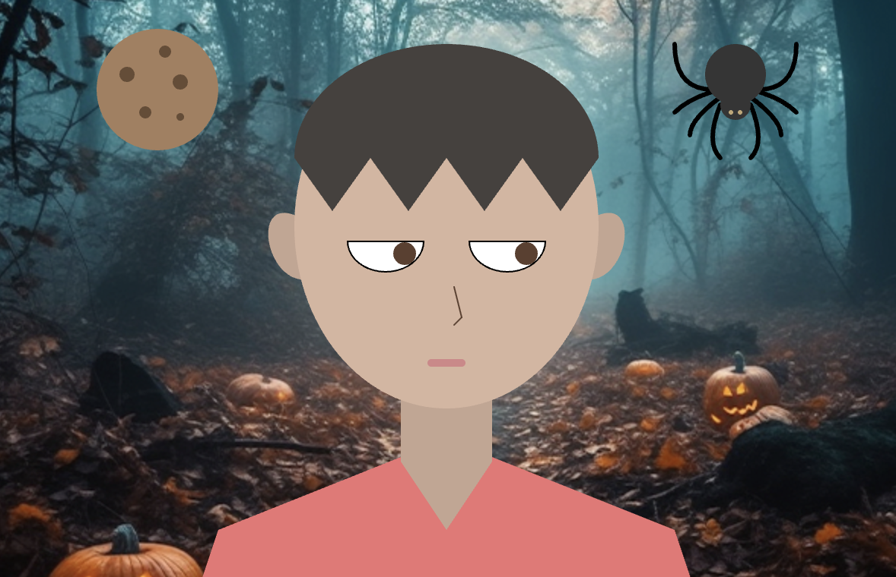

# Art Jam - Self-Portrait

Ray Hernaez

[View this project online](https://rayhernaez.github.io/cart253/projects/art-jam/index.html)

## Description

A playful self-portrait built with p5.js. Drag the **cookie** or the **spider** to my face to change my expression. The eyes follow your mouse.

### Controls & Interaction

- Click & drag the cookie or the spider.
- Cookie on my head → I smile.
- Spider on my head → I'm sad.
- My eyes follow your mouse!

## Screenshot(s)

## New p5 functions I tried

- **translate()** is used to move the spider (legs + body).
- **vertex(), bezierVertex(), quadtraticVertex(), arc()** is used to draw curve lines and cut ellipses.

## Attribution

- **JavaScript libraries:** [p5.js](https://p5js.org)
- **Background Image:** AI-generated found [online](https://www.vecteezy.com/free-photos/halloween)

## License

This project is licensed under a Creative Commons Attribution ([CC BY 4.0](https://creativecommons.org/licenses/by/4.0/deed.en)) license with the exception of libraries and other components with their own licenses.