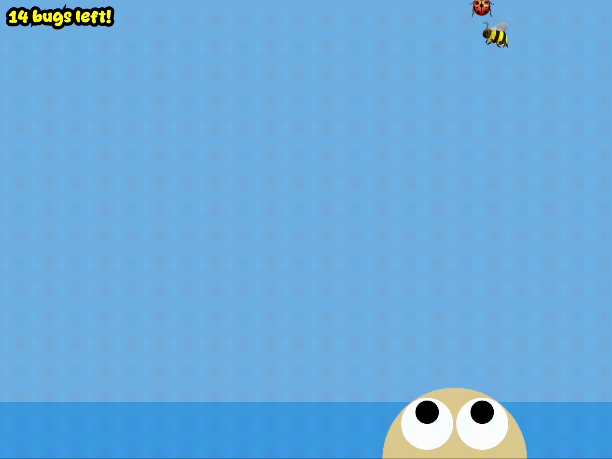

# Mod Jam - Froggy, the Avatar 🐸

Ray Hernaez

[Play it!](https://rayhernaez.github.io/cart253/projects/mod-jam/index.html)

## Description

A mini p5.js game that is a modified version of [frogfrogfrog](https://pippinbarr.com/cart253/topics/making/examples/frogfrogfrog.zip). Froggy is the new Avatar (inspired by Avatar: The Last Airbender) and he can bend all 4 elements (Water, Earth, Fire, Air). Bugs are swarming down to his beloved pond. Use elemental attacks to stop them! There are 15 bugs in total. Each kill changes the sky colour which transitions from day to night.

### Controls & Interaction

- Move Froggy with your mouse
- Click mouse to attack
    - Hit a bug twice to defeat them
- Switch element:
    - W = Water 💦 (against Blue Bugs 🦋)
    - E = Earth 🪨 (against Green Bugs 🪲)
    - F = Fire 🔥 (against Red Bugs 🐞)
    - A = Air 💨 (against Yellow Bugs 🐝)
    
### Win/Fail
- You win if you defeat all 15 bugs.
- You fail if a bug reaches the pond.

## Gameplay GIF

## Features

- Title + Info + Ending screens
- Scoring System: Transition day to night per kill
- 2 bug movements: zigzag & buzz
- New visual effects:
    - Frog eyes + squint
    - Bugs shrink when hit
- New features:
    - Use of W/E/F/A keys to switch elements
    - Use of emojis to draw elements + bugs
    - Use of buttons

## New p5 functions I tried

- Arrays
- While loop
- For loop
- splice
- max
- millis
- cursor & noCursor
- fonts

## Attribution

- **JavaScript libraries:** [p5.js](https://p5js.org)
- **Bestime Font:** from [Dafont](https://www.dafont.com/)

## License

This project is licensed under a Creative Commons Attribution ([CC BY 4.0](https://creativecommons.org/licenses/by/4.0/deed.en)) license with the exception of libraries and other components with their own licenses.
