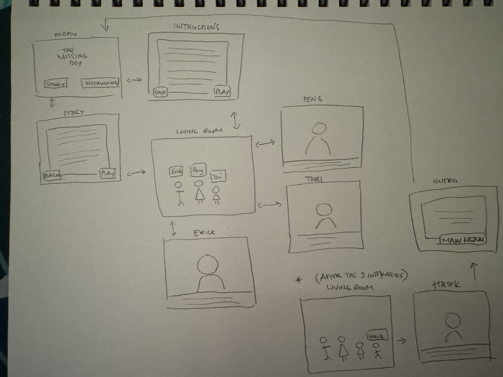

# Variation Jam plan

Ray Hernaez

## Concept

- You are an interviewer collecting facts
- **Goal:** Interview all 3 family members
- **Loop:** Living room (choose a family member) -> dialogue scene -> return to living room

## Scenes

- Menu -> Living Room -> Interview Dad -> Living Room -> Interview Mom -> Living Room -> Interview Sister -> Living Room (Missing boy appears) -> Interview Hawk -> end

## Interactions

- **Menu:** Clickable buttons
    - Story & Instructions
    - Play
- **Living Room:** Clickable characters
- **Dialogue Scene:** Character facing the camera
    - Animations: Blinking eyes, mouth movement while talking
    - Clickable Dialogue Box at the bottom
- Auto-Return to Living Room after character's last dialogue line
- When Missing boy appears, he can be clickable
    - Triggers his dialogue scene
- End scene
    - Recap
    - Play again button
    
## Assets

- Backgrounds
    - Living room
    - 3 different interview backgrounds
- Characters
    - Erick is Dad
    - Peng is Mom
    - Tori is sister
    - Hawk is missing boy
- Sounds
    - BG music
    - button clicks
    - voices?
    
## Plan (screeny)

## STEPS 🎈

### Story & Dialogues
- Write the menu texts, story, dialogue lines ✅
- Images to use ✅

### Menu
- Title ✅
    - Story ✅
    - Instruction ✅
    - Play ✅

### Selection Scene
- Living room with the 3 characters ✅
    - Clickable names below them? ❌

### Dialogue Scenes
- Dad scene ✅
- Mom scene ✅
- Sister scene ✅

### Selection Scene + Hawk appearance
- Animate Hawk appearing into the living room
    - Clickable name below him
    
### Hawk's Dialogue Scene
- Hawk scene ✅

### Ending Scene
- Recap
- Credits
- Play again button